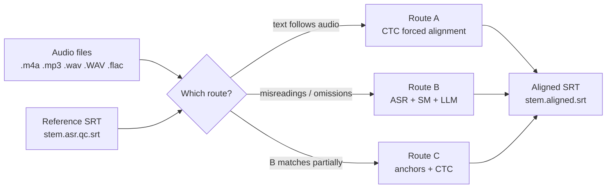

# Multilingual SRT Forced Aligner

A set of Python scripts that align subtitle text to audio and write timestamped
SRT files. Input: audio files and a reference SRT whose text has been verified
for correctness. Output: the same subtitle lines with per-line start/end
timestamps.

[](LICENSE)
[](#language-support)
[](#requirements)

[中文文档](README.zh-CN.md)

## Contents

- [Overview](#overview)
- [Route A — CTC forced alignment](#route-a--ctc-forced-alignment)
- [Route A (parallel)](#route-a-parallel)
- [Route B — ASR + sequence matching + LLM](#route-b--asr--sequence-matching--llm)
- [Route C — hybrid (anchors + CTC)](#route-c--hybrid-anchors--ctc)
- [Choosing a route](#choosing-a-route)
- [Requirements](#requirements)
- [Language support](#language-support)
- [Output file format](#output-file-format)
- [License](#license)

## Overview



| Script | Approach |
|---|---|
| `align_srt_routeA.py` | CTC forced alignment of the SRT text onto the audio (no ASR step) |
| `align_srt_routeA_multi.py` | Route A, run in parallel over several files |
| `align_srt_routeB_llm.py` | ASR transcription + sequence matching + LLM matching |
| `align_srt_routeC_hybrid.py` | Hybrid: Route B matches as anchors, CTC alignment around them |

The scripts are configured through module constants at the top of each file and,
for Route A, through command-line arguments.

---

## Route A — CTC forced alignment

File: `align_srt_routeA.py`

Approach: the SRT text itself is passed to WhisperX's CTC aligner
(`whisperx.align`). No speech-recognition step is involved; timestamps are
obtained directly from the acoustic alignment of the given text.

Alignment model by language (configured in `LANG_CONFIG`):

| Language | Alignment model |
|---|---|
| es | WhisperX default (torchaudio VOXPOPULI model) |
| fr | WhisperX default (torchaudio VOXPOPULI model) |
| ja | WhisperX default |
| ru | `jonatasgrosman/wav2vec2-large-xlsr-53-russian` |

Processing details (as implemented):

- Alignment unit: **words** for es/fr/ru, **characters** for ja (character
  alignments are requested from WhisperX for ja).
- Word/character timestamps are mapped back to SRT lines with an LCS dynamic
  programming pass.
- Consecutive lines that could not be matched receive timestamps interpolated
  in proportion to their text length.
- Every line is clamped to end at least 50 ms before the next line starts.
- Outlier correction pass: a line is flagged when it has at least 3 units,
  lasts at least 6 seconds, its unit rate is below 1.5 units/s (3 chars/s for
  Japanese) and the gap to the previous line is below 0.3 s. Its start is then
  moved (at least 1.5 s forward) to the first speech onset found by
  Silero-VAD. If Silero-VAD cannot be loaded, a 20 ms-frame RMS energy
  threshold is used instead.
- Audio longer than 1800 s is split into equal-time chunks, each aligned with
  the corresponding share of lines.

Inputs and outputs:

- Audio formats scanned: `.m4a`, `.mp3`, `.wav`, `.WAV`, `.flac`.
- Reference SRT: `{stem}.asr.qc.srt` next to the audio file.
- Output: `{stem}.aligned.srt`, UTF-8 with BOM, CRLF line endings.

Command line:

```
--lang        es | fr | ru | ja        (default: ru)
--audio-dir   directory with audio+SRT (default: /root)
--output-dir  output directory         (default: /root/aligned_routeA)
```

Example:

```bash
python align_srt_routeA.py --lang es --audio-dir /root --output-dir /root/aligned_routeA
```

## Route A (parallel)

File: `align_srt_routeA_multi.py`

Runs Route A over several files at once using `multiprocessing` (spawn method).
Each worker process loads its own alignment model; the core alignment logic is
imported from `align_srt_routeA.py`.

Differences from the single-file script:

- Reference SRT matching order: `{stem}_tgt.asr.qc.srt`, then
  `{stem}.asr.qc.srt`.
- Additional `--align-model` option to override the per-language default model.
- Prints a per-file summary (status, seconds per file) and an estimated
  speedup over serial processing.

Command line:

```
--lang         es | fr | ru | ja   (default: es)
--audio-dir    required
--output-dir   required
--workers      process count       (default: 5)
--align-model  optional model override
```

Example:

```bash
python align_srt_routeA_multi.py --lang es --audio-dir /root --output-dir /root/aligned_routeA --workers 5
```

## Route B — ASR + sequence matching + LLM

File: `align_srt_routeB_llm.py`

Intended for recordings whose speech deviates from the reference text
(misreadings, omissions, repetitions), where a direct forced alignment of the
reference text does not apply.

Steps, in order:

1. **Transcription**: faster-whisper, model size `large-v3`, compute type
   `float16`; VAD filter enabled (min silence 400 ms, threshold 0.3);
   temperature 0.0, beam size 5, previous-text conditioning disabled.
2. **Repeated-segment filter**: transcript segments whose normalized text
   similarity to any of the previous five segments exceeds 0.70 are removed.
3. **SequenceMatcher matching**: for each reference line, a windowed search
   (up to 80 segments ahead, accumulating at most 20 segments, capped at 3x
   the reference length). Accepted when similarity reaches 0.40; searching
   stops early at 0.85.
4. **LLM matching**: lines not matched in step 3 are sent to an LLM in
   batches of 8. The LLM is called through an OpenAI-compatible chat API
   (default base URL `https://dashscope.aliyuncs.com/compatible-mode/v1`,
   default model `qwen3.6-plus`); the API key is read from the `LLM_API_KEY`
   environment variable. The LLM is asked to return a JSON mapping of line
   number to transcript segment range.
5. Lines matched by neither step are omitted from the output.

Configuration is via module constants at the top of the file (there are no
command-line arguments). Defaults: scan directory `/root`, output directory
`/root/aligned_routeB`, reference SRT `{stem}.asr.qc.srt`, output
`{stem}.aligned.srt` (plain UTF-8, LF line endings).

Languages: es, fr, ru.

Example:

```bash
export LLM_API_KEY=...
python align_srt_routeB_llm.py
```

## Route C — hybrid (anchors + CTC)

File: `align_srt_routeC_hybrid.py`

Runs Route B's sequence-matching + LLM step to obtain **anchors** (reference
lines with timestamps), then aligns the remaining lines against the audio
with CTC inside the windows between anchors.

Block construction (as implemented):

- Anchor lines keep their Route B timestamps (block window: anchor ± 0.5 s).
- A gap between two anchors is aligned as one block, its window being the
  interval between the anchor windows; head/tail gaps are bounded by the
  audio edges.
- If no anchor is obtained, a single block covering the whole audio is used —
  equivalent to running Route A on the full file.
- Word-level DP mapping and the same outlier-correction pass as Route A
  (unit-rate threshold 1.3 units/s) are applied.

Configuration is via module constants (no command-line arguments). Defaults:
audio glob `{language}_*.{m4a|mp3|wav|flac}`, scan directory `/root`, output
`/root/aligned_routeC`, reference SRT `{stem}.asr.qc.srt`.

Languages: es, fr, ru.

Example:

```bash
export LLM_API_KEY=...
python align_srt_routeC_hybrid.py
```

## Choosing a route

| Situation | Route |
|---|---|
| The recording closely follows the reference text | A |
| Frequent misreadings, omissions, or extra words | B |
| Route B matches only part of the lines | C |

(Route B's own output ends with the same guidance: prefer Route A when the
recording and the reference text are highly consistent.)

## Requirements

- A CUDA-capable GPU; the scripts set `DEVICE = "cuda"`.
- Python dependencies by route: `whisperx` (A, C); `faster-whisper`, `openai`
  (B, C); `silero-vad` (A, C — optional, an RMS fallback is used if it cannot
  be loaded); `num2words` (A, C — optional, digits are expanded to words when
  available).
- The scripts set `HF_HOME` and `TORCH_HOME` to `/root/autodl-tmp` and default
  input/output directories under `/root`. They are written for a Linux GPU
  server; to run them on another machine, edit the constants at the top of the
  respective file.
- Audio decoding is delegated to whisperx / faster-whisper, which use ffmpeg.

## Language support

| Script | es | fr | ru | ja |
|---|---|---|---|---|
| `align_srt_routeA.py` | yes (word) | yes (word) | yes (word) | yes (char) |
| `align_srt_routeA_multi.py` | yes | yes | yes | yes |
| `align_srt_routeB_llm.py` | yes | yes | yes | no |
| `align_srt_routeC_hybrid.py` | yes | yes | yes | no |

## Output file format

| Script | Encoding / line endings |
|---|---|
| `align_srt_routeA.py`, `align_srt_routeA_multi.py` | UTF-8 with BOM, CRLF |
| `align_srt_routeB_llm.py`, `align_srt_routeC_hybrid.py` | UTF-8 without BOM, LF |

## License

This project is source-available under the terms in [LICENSE](LICENSE): the
code may be viewed and run for private, personal, non-commercial evaluation.
Any other use — including corpus construction, institutional or systematic
academic use, redistribution, and commercial use — requires the copyright
holder's prior written consent. Contact the repository owner to request
consent for a specific use.