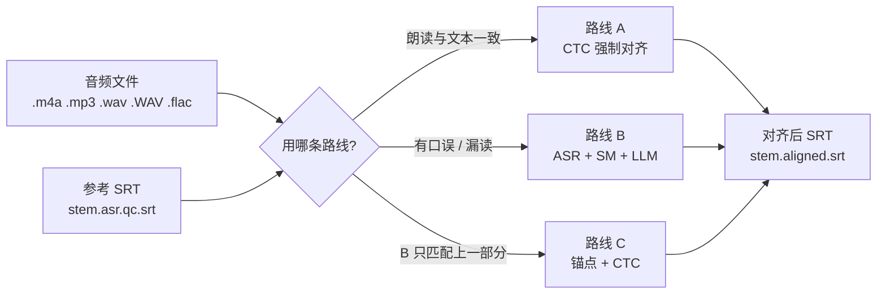

# 多语言 SRT 强制对齐

一组把字幕文本对齐到音频、并输出带时间戳 SRT 文件的 Python 脚本。
输入：音频文件和一份文字已经校对过的参考 SRT。
输出：同样的字幕行，附上逐行的起止时间戳。

[](LICENSE)
[](#%E8%AF%AD%E8%A8%80%E6%94%AF%E6%8C%81)
[](#%E8%BF%90%E8%A1%8C%E8%A6%81%E6%B1%82)

[English](README.md)

## 目录

- [概述](#概述)
- [路线 A — CTC 强制对齐](#路线-a--ctc-强制对齐)
- [路线 A（并行版）](#路线-a并行版)
- [路线 B — ASR + 序列匹配 + LLM](#路线-b--asr--序列匹配--llm)
- [路线 C — 混合式（锚点 + CTC）](#路线-c--混合式锚点--ctc)
- [路线选择](#路线选择)
- [运行要求](#运行要求)
- [语言支持](#语言支持)
- [输出文件格式](#输出文件格式)
- [许可证](#许可证)

## 概述



| 脚本 | 做法 |
|---|---|
| `align_srt_routeA.py` | 用 CTC 对 SRT 文本做强制对齐（不含语音识别步骤） |
| `align_srt_routeA_multi.py` | 路线 A 的多进程并行版本 |
| `align_srt_routeB_llm.py` | ASR 转录 + 序列匹配 + LLM 匹配 |
| `align_srt_routeC_hybrid.py` | 混合式：路线 B 匹配结果做锚点，围绕锚点做 CTC 对齐 |

路线 A 通过命令行参数配置；其余脚本通过文件顶部的模块常量配置。

---

## 路线 A — CTC 强制对齐

文件：`align_srt_routeA.py`

做法：把 SRT 文本本身交给 WhisperX 的 CTC 对齐器（`whisperx.align`）。
不经过语音识别环节，时间戳直接来自给定文本的声学对齐结果。

各语言使用的对齐模型（在 `LANG_CONFIG` 中配置）：

| 语言 | 对齐模型 |
|---|---|
| es | WhisperX 默认（torchaudio 的 VOXPOPULI 模型） |
| fr | WhisperX 默认（torchaudio 的 VOXPOPULI 模型） |
| ja | WhisperX 默认 |
| ru | `jonatasgrosman/wav2vec2-large-xlsr-53-russian` |

处理细节（与实现一致）：

- 对齐单位：es/fr/ru 按**词**，ja 按**字符**（ja 会向 WhisperX 请求字符级
  对齐结果）。
- 词/字符时间戳通过 LCS 动态规划映射回 SRT 各行。
- 连续未能匹配的行，按文字长度比例插值分配时间。
- 每行会被钳制为在下一行开始前至少 50 ms 结束。
- 异常起点修正：一个行的单位数 ≥ 3、时长 ≥ 6 秒、单位速率低于 1.5 单位/秒
  （日语 3 字符/秒），且与上一行的间隔小于 0.3 秒时被判为可疑，其起点会向后
  移动至少 1.5 秒、吸附到 Silero-VAD 检测到的第一个语音起点；Silero-VAD 加载
  失败时改用 20 ms 帧长的 RMS 能量阈值。
- 音频时长超过 1800 秒时按等时长分块，每块配对应份额的行。

输入与输出：

- 扫描的音频格式：`.m4a`、`.mp3`、`.wav`、`.WAV`、`.flac`。
- 参考 SRT：与音频同目录的 `{stem}.asr.qc.srt`。
- 输出：`{stem}.aligned.srt`，UTF-8 带 BOM，CRLF 行尾。

命令行参数：

```
--lang        可选 es/fr/ru/ja      （默认 ru）
--audio-dir   音频+SRT 所在目录     （默认 /root）
--output-dir  输出目录              （默认 /root/aligned_routeA）
```

示例：

```bash
python align_srt_routeA.py --lang es --audio-dir /root --output-dir /root/aligned_routeA
```

## 路线 A（并行版）

文件：`align_srt_routeA_multi.py`

用 `multiprocessing`（spawn 方式）同时对多个文件跑路线 A。每个子进程各自加载
对齐模型；核心对齐逻辑从 `align_srt_routeA.py` 导入。

与单文件版的不同：

- 参考 SRT 匹配顺序：先 `{stem}_tgt.asr.qc.srt`，再 `{stem}.asr.qc.srt`。
- 新增 `--align-model` 参数，可覆盖各语言的默认模型。
- 结束时打印每个文件的状态/耗时汇总，以及相对串行的估算加速比。

命令行参数：

```
--lang         语言（默认 es）
--audio-dir    必填
--output-dir   必填
--workers      并行进程数（默认 5）
--align-model  可选，覆盖默认对齐模型
```

示例：

```bash
python align_srt_routeA_multi.py --lang es --audio-dir /root --output-dir /root/aligned_routeA --workers 5
```

## 路线 B — ASR + 序列匹配 + LLM

文件：`align_srt_routeB_llm.py`

适用于朗读与参考文本不一致的录音（读错词、漏读、多读），这种情况下对参考文本
直接做强制对齐不适用。

步骤：

1. **转录**：faster-whisper，模型 `large-v3`、`float16`；开启 VAD 过滤（最短
   静音 400 ms，阈值 0.3）；温度 0.0、beam 5、关闭上下文条件化。
2. **重复段过滤**：与之前 5 段中任一段的归一化相似度超过 0.70 的转录段被移除。
3. **SequenceMatcher 匹配**：对每个参考行做窗口搜索（向前最多 80 段，最多合并
   20 段，累积长度上限为参考文本 3 倍），相似度达到 0.40 即采用，达到 0.85 提前
   停止搜索。
4. **LLM 匹配**：第 3 步未匹配的行以每批 8 行交给 LLM。LLM 走 OpenAI 兼容接口
   （默认地址 `https://dashscope.aliyuncs.com/compatible-mode/v1`，默认模型
   `qwen3.6-plus`），API 密钥从环境变量 `LLM_API_KEY` 读取；LLM 被要求返回
   「行号 → 转录段范围」的 JSON。
5. 两种方法都未匹配上的行不会出现在输出中。

配置在文件顶部常量中（没有命令行参数）。默认：扫描目录 `/root`，输出目录
`/root/aligned_routeB`，参考 SRT `{stem}.asr.qc.srt`，输出 `{stem}.aligned.srt`
（普通 UTF-8，LF 行尾）。

支持语言：es、fr、ru。

示例：

```bash
export LLM_API_KEY=...
python align_srt_routeB_llm.py
```

## 路线 C — 混合式（锚点 + CTC）

文件：`align_srt_routeC_hybrid.py`

先跑路线 B 的序列匹配 + LLM 流程得到**锚点**（带时间戳的已匹配行），再把其余
行放在锚点之间的窗口内用 CTC 做精对齐。

分块规则（与实现一致）：

- 锚点行直接沿用路线 B 的时间戳（块窗口取锚点 ± 0.5 秒）。
- 两个锚点之间的行作为一个块，窗口为两个锚点窗口之间的区间；文件头尾的块用音频
  边界兜底。
- 一个锚点都没有时，整个音频作为单块处理——等价于对全文件直接跑路线 A。
- 词级 DP 映射与路线 A 相同的异常起点修正（单位速率阈值 1.3 单位/秒）。

配置在常量中（无命令行参数）。默认：音频通配 `{language}_*.{m4a|mp3|wav|flac}`，
扫描目录 `/root`，输出 `/root/aligned_routeC`，参考 SRT `{stem}.asr.qc.srt`。

支持语言：es、fr、ru。

示例：

```bash
export LLM_API_KEY=...
python align_srt_routeC_hybrid.py
```

## 路线选择

| 情况 | 用哪条路线 |
|---|---|
| 录音与参考文本基本一致 | A |
| 口误、漏读、多读较多 | B |
| 路线 B 只能匹配一部分行 | C |

（路线 B 自身的输出结尾也给出同样的建议：录音与参考文本高度一致时优先用路线 A。）

## 运行要求

- 需要 CUDA GPU；脚本内固定 `DEVICE = "cuda"`。
- 按路线区分依赖：`whisperx`（A、C）；`faster-whisper`、`openai`（B、C）；
  `silero-vad`（A、C——可选，加载失败时退化为 RMS 兜底）；`num2words`
  （A、C——可选，可用时把数字展开为读法）。
- 脚本把 `HF_HOME`、`TORCH_HOME` 设为 `/root/autodl-tmp`，默认目录也在 `/root`
  下；是为 Linux GPU 服务器环境编写的，换机器运行需修改文件顶部常量。
- 音频解码由 whisperx / faster-whisper 内部完成（依赖 ffmpeg）。

## 语言支持

| 脚本 | es | fr | ru | ja |
|---|---|---|---|---|
| `align_srt_routeA.py` | 支持（按词） | 支持（按词） | 支持（按词） | 支持（按字符） |
| `align_srt_routeA_multi.py` | 支持 | 支持 | 支持 | 支持 |
| `align_srt_routeB_llm.py` | 支持 | 支持 | 支持 | 不支持 |
| `align_srt_routeC_hybrid.py` | 支持 | 支持 | 支持 | 不支持 |

## 输出文件格式

| 脚本 | 编码 / 行尾 |
|---|---|
| `align_srt_routeA.py`、`align_srt_routeA_multi.py` | UTF-8 带 BOM、CRLF |
| `align_srt_routeB_llm.py`、`align_srt_routeC_hybrid.py` | UTF-8 不带 BOM、LF |

## 许可证

本项目按 [LICENSE](LICENSE) 中的条款以「源码可见」方式发布：代码可被查看，并
可用于个人、私下、非商业的评估运行。除此之外的任何使用——包括语料库建设、机构化
或成体系的学术用途、再分发、商业用途——均需事先取得版权人的书面同意。如需就特定
用途取得同意，请联系仓库所有者。